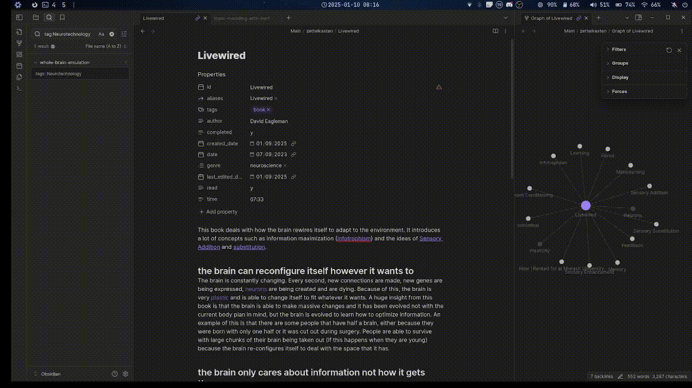
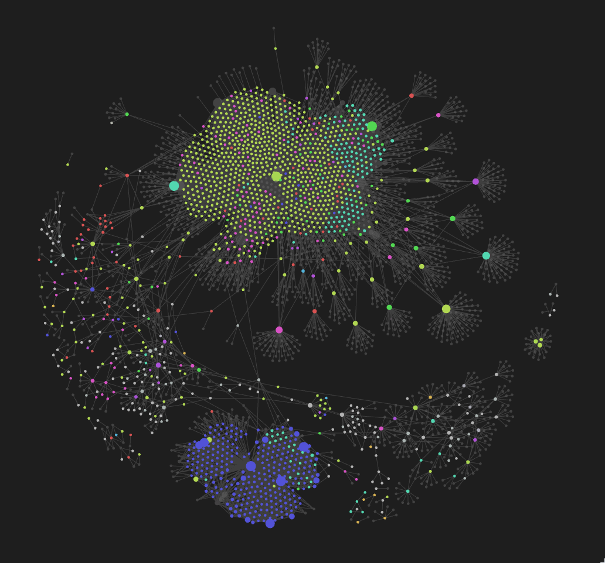
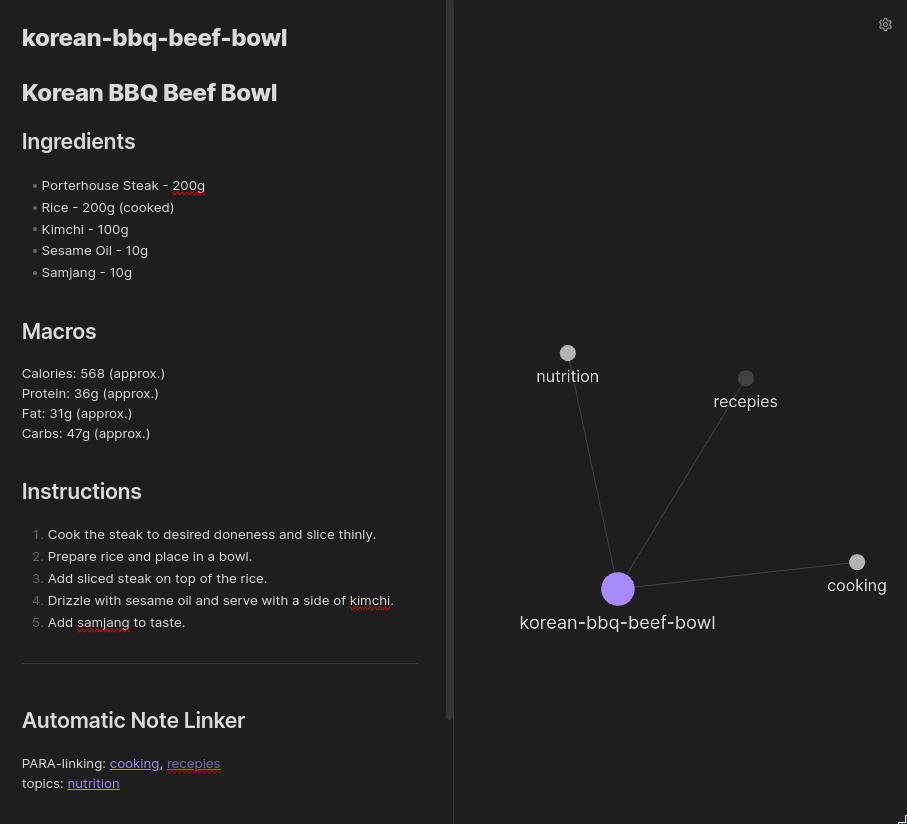
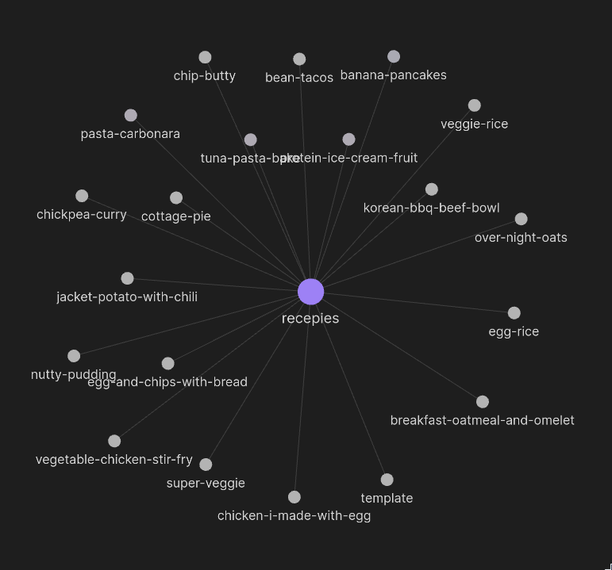
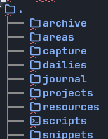

#### Description

This is a project I made to improve my knowledge system. It uses topic modeling to add topics to notes the user has written.

#### The Problem

I use [Obsidian](https://obsidian.md/), which comes with a very nice linking feature that allows you to manuver between notes quickly and explore different topics.

It also has a very cool view where you can see all the notes you've written.

The problem comes that there are topics I have written about, or am interested in, that I forgot to include in the notes. I have over 1,000 notes and it would be tiresome to label all of the notes with their corresponding topics. Moreover, I use the [PARA method](https://workflowy.com/systems/para-method/) to organize my notes, and the folder name doesn't interface with the linking system, which makes it harder to find related notes.

The **solution** to this is to have an automated system that creates topic labels for notes depending on the note's content. It also uses the folders and sub folders to create links, creating topics that way.

<!--I use Neovim and [obsidian.nvim](https://github.com/epwalsh/obsidian.nvim) I use the [PARA method](https://workflowy.com/systems/para-method/) to organize my notes,-->

## Features

- Add links to your notes based on the content of the note.
  
- Adds the folder structure into your notes
  
- Uses [BERTopic](https://github.com/MaartenGr/BERTopic) for [topic modeling](en.wikipedia.org/wiki/Topic_model), and [LaMMa 3.2](https://ollama.com/) for topic labeling.
- BERTopic used all of wikipedia for topic modeling, expanding the robustness and range of topics

## Example

After running the program, you can see how the program added the `cooking` and `receipes` topics to the note because that was the folder structure it was in. Through topic modeling, it automatically added the `nutrition` topic.

You can see now all recepies are linked together:

<!--## Visualizations-->
<!---->
<!--Visualizations were made with [BERTopic](https://maartengr.github.io/BERTopic/getting_started/visualization/visualization.html)-->
<!---->
<!--#### Topic similarities-->
<!---->
<!--#### Words that compose each topic-->
<!---->
<!--`topic_model.visualize_barchart()`-->
<!---->
<!--## Table of Contents-->
<!---->
<!--- [Installation](#installation)-->
<!--- [Usage](#usage)-->
<!--- [Contributing](#contributing)-->
<!--- [License](#license)-->
<!--- [Contact](#contact)-->
<!--- [Acknowledgments](#acknowledgments)-->

## Installation

I use NixOS, so to install the necessary environment it is as simple as running `nix-shell shell.nix`.

This will create a shell where you can run the project.

## Usage

> [!WARNING]
> Before running this code, ensure you have created a backup of your notes! This code will modify your notes.

Your target directory should look something like:

To use this program, all you need to do is run `python main.py ~/PATH_TO_YOUR_PARA_ROOT`.

And that's it! The program will add the topics and folder structure to your notes.

#### Running your own topic modeling

To run topic modeling yourself, you can download wikipedia using the `download_wikipedia.py` script. This will download the wikipedia dump and create markdown files to train your model. After running that script, you can run the `python bert_topic_modeling.py ~/PATH_TO_YOUR_PARA_ROOT` script to train the model on that data as well as your notes to get a better representation of topics.

After doing that, run `ollama pull llama3.2` to install the llama3.2 model, and then run `python generate_topic_labels.py` to create the human interpretable topic labels. After running, it will ask you to label any topics the model has trouble on.

## TODO

- [ ] Ensure notes don't have conflicting titles/content when doing note similarity check.

## Contact

- **Email:** handzelmatthew@gmail.com
- **LinkedIn:** [Matt Handzel](https://www.linkedin.com/in/matthewhandzel/)
